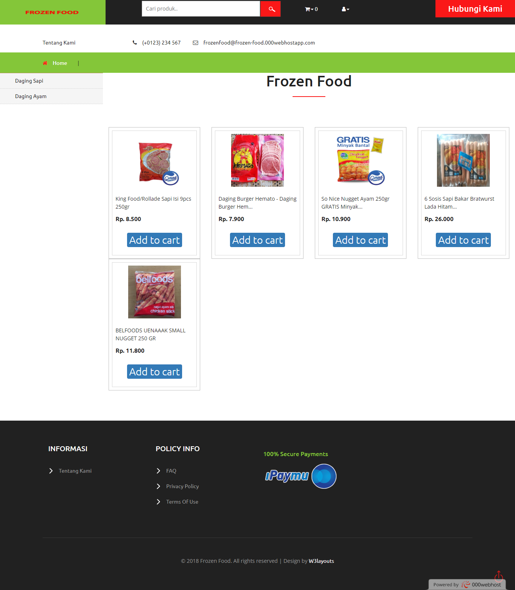
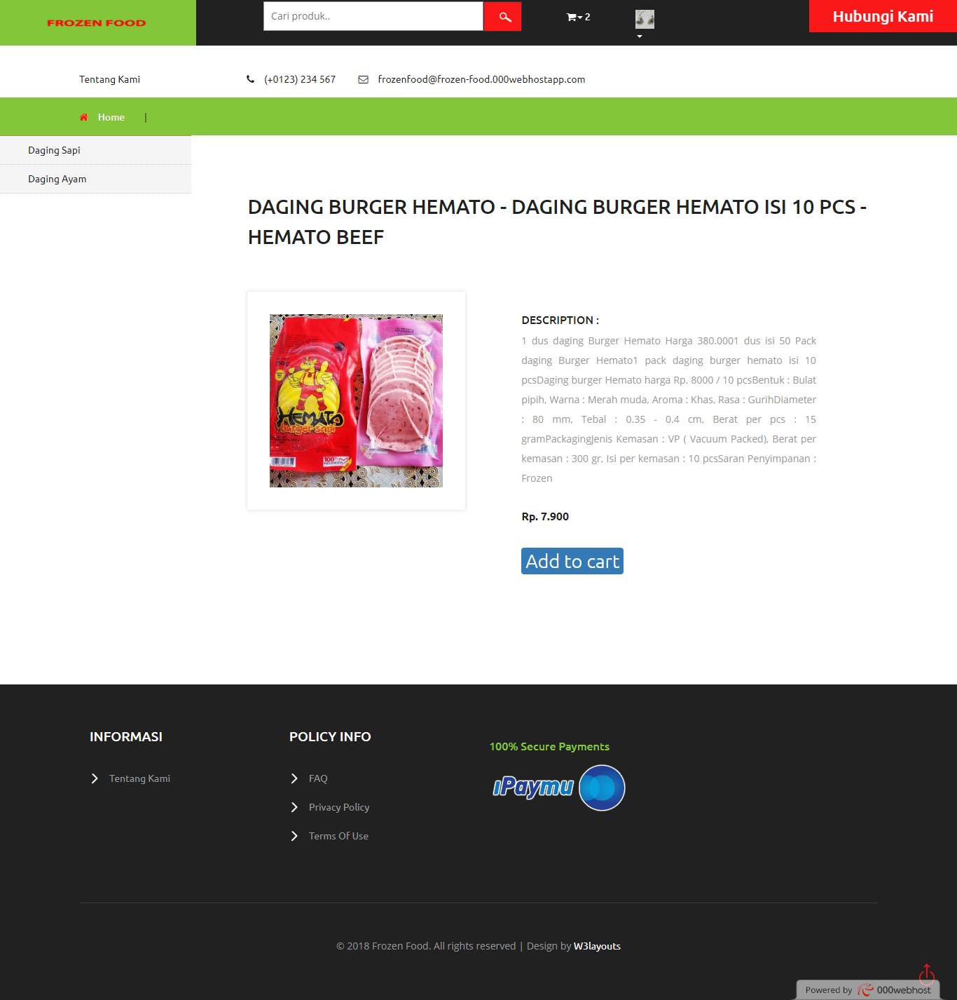
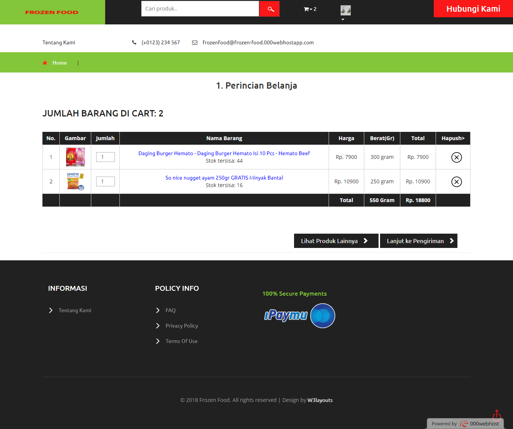
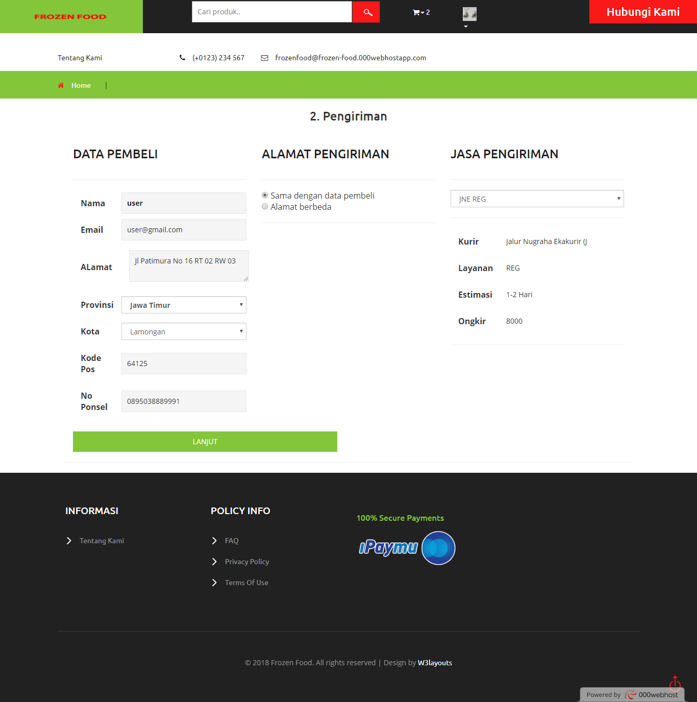
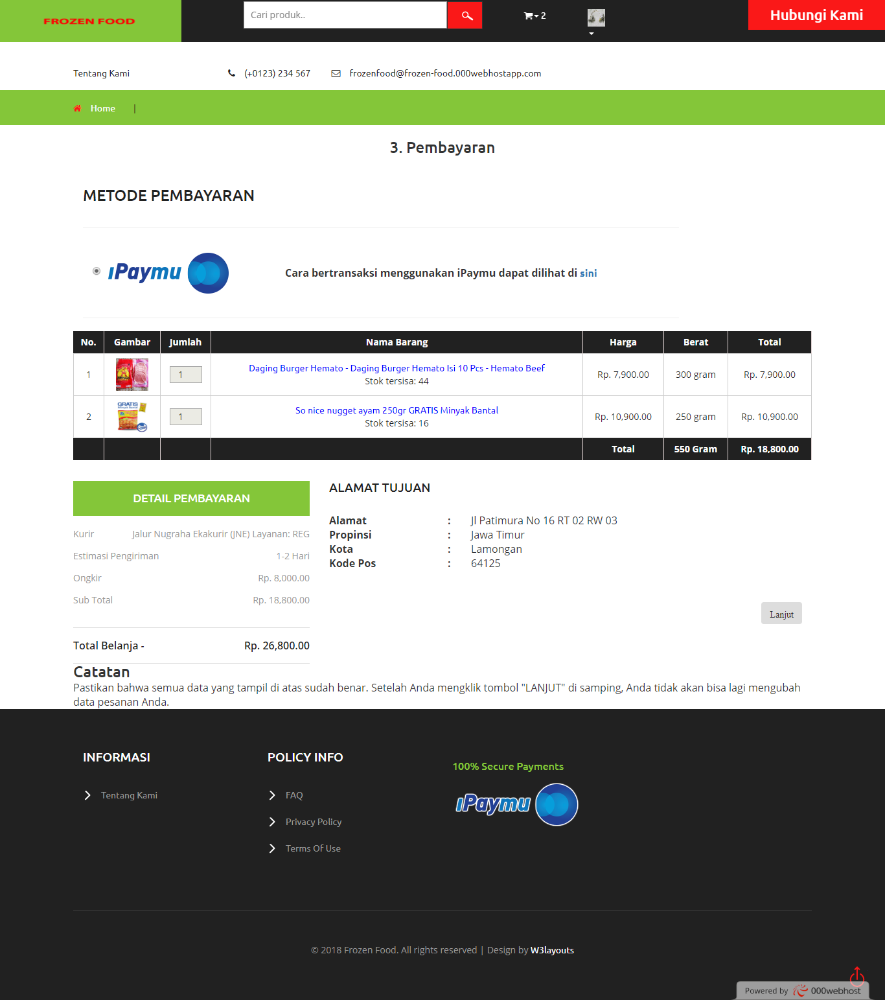
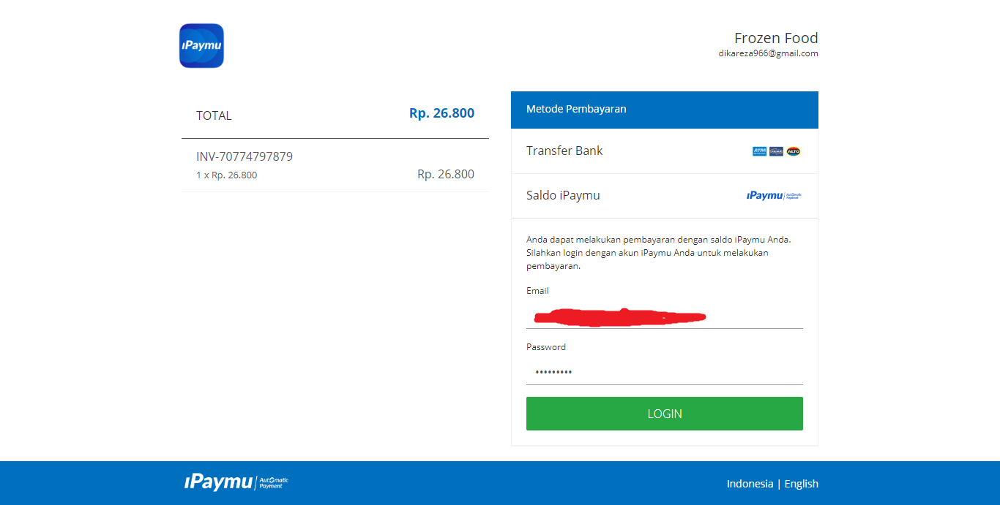
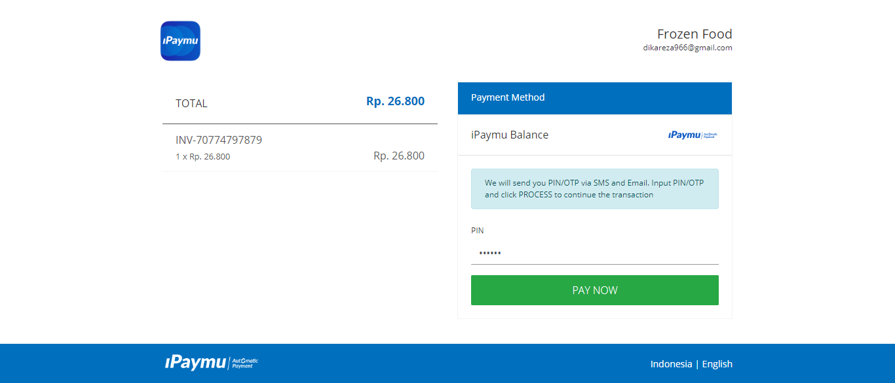
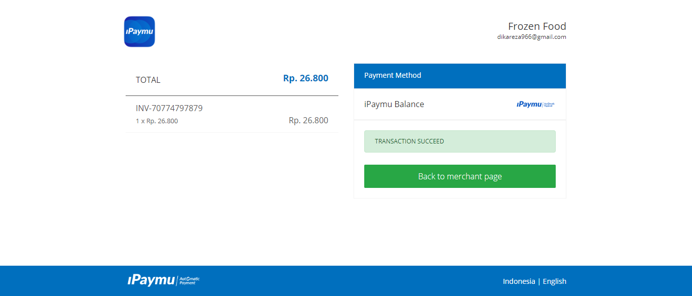
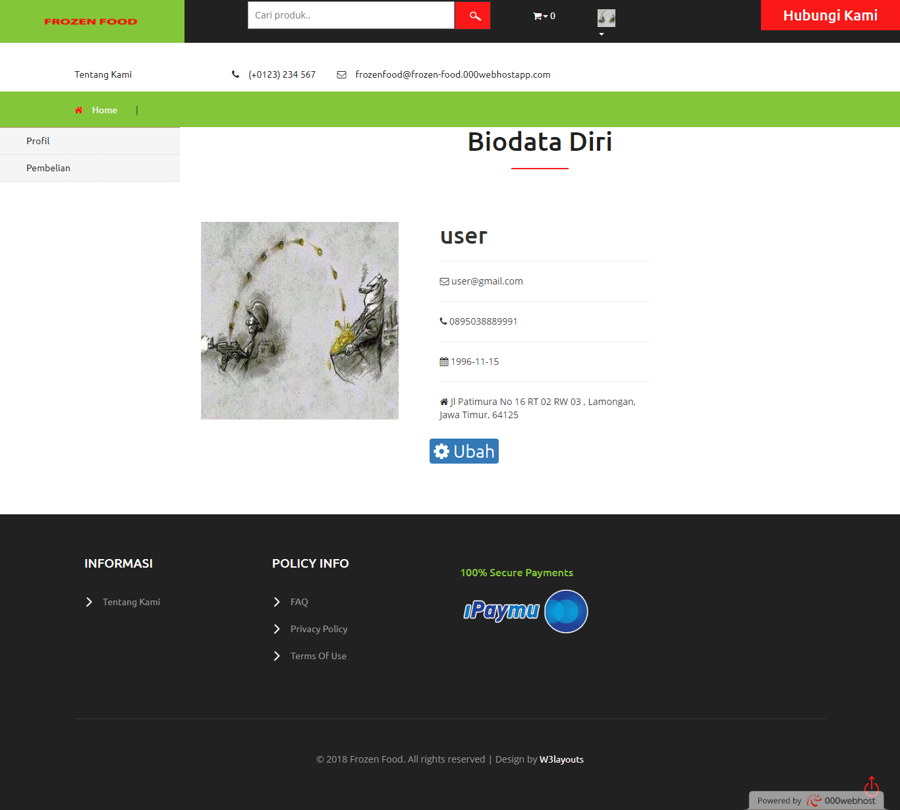
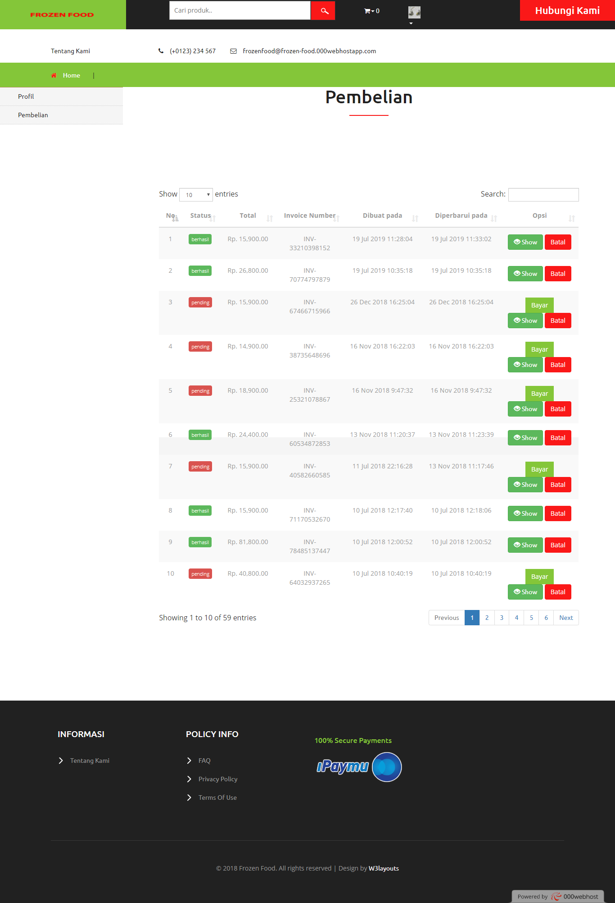

## E-commerce Frozen Food

Aplikasi e-commerce toko Frozen Food dengan pembayaran payment gateway IPAYMU.

#### Fitur
- [x] Register Member
- [x] Login
- [x] Keranjang belanja
- [x] Dukungan pengiriman JNE/TIKI
- [x] Pembayaran mudah dengan IPAYMU
- [x] Pengaturan akun

#### Teknologi
- [Laravel](https://laravel.com)
- [PHP](https://php.net)

#### Demo
[E-commerce Frozen Food](https://frozen-food.000webhostapp.com/)

#### Screenshot

| Home | Detail produk |
| :---: | :---: |
|  | 
| Kerangjang Belanja | Pengiriman |
| :---: | :---: |
|  | 
| Pembayaran | Halaman IPAYMU |
| :---: | :---: |
|  | 
| Konfirmasi Transaksi | Transaksi Sukses |
| :---: | :---: |
|  | 
| Halaman Profil | Riwayat Pembelian |
| :---: | :---: |
|  | 

